# Super Depth — 解析と C 移植（作業中）

Bio_100% の PC-98 用ゲーム **Super Depth ver 1.00**（1991、alty & tacox）を、
実行ファイルを Ghidra で逆コンパイルして解析し、C 言語に書き直して
最終的に WASM で動かすためのリポジトリです。

Windows 版の続編 **WinDepth** の移植はこちら → https://github.com/yomei-o/windepth_wasm
（自機の名前 `YAMABOKU` が両方に出てきます）

**ひととおり遊べます。** タイトル → ステージ 1〜12（一周する）→ ゲームオーバー
→ ネーム入力 → ランキング → タイトル。
続きの作業に入る人は [RESUME.md](RESUME.md) の冒頭「引き継ぎ」から読んでください
（いまどこまで／次にやること／刺された罠）。

遊ぶ: https://yomei-o.github.io/super_depth_wasm/

できていること: **タイトルから始まって 4 種類の面が全部遊べて、音も鳴ります。**
640×400 16 色の画面と本物のパレット（毎フレームの色替えも）、BFNT スプライト
238 枚、敵 5 種の湧き・移動・射撃・撃墜と爆発、アイテム 7 種とフラッシュボム、
PC-98 のテキストプレーンによる HUD（スコア・残機・枠・レーダー・メッセージ）、
面クリアと死亡の遷移、フェード、BGM 15 曲と効果音 6 種（内蔵ビープ 1 音）。
コマ数も原典どおり（VSYNC 5 回に 1 コマ＝毎秒 11）。

面の中身は種別ごとにまるごと違います。

| 種別 | 中身 |
|---|---|
| 1 SEA | 海。自機は水面を左右に動き、左右 2 門の爆雷を沈める |
| 2 SKY | 空。自機は画面下で上へ撃つ。敵は上から降りてきて爆弾を落とす |
| 3 SPACE | 宇宙。自機は上下に動いて左右へ撃つ。左右キーで世界のほうが流れる |
| 4 BOSS | ボス 3 体（ステージ 4 / 8 / 12）。弱点に 20 発で倒せる |

面と面のあいだには演出が 3 本（海から飛び立つ／大気圏を抜ける／警報）、
タイトルには `DEPTH.FNT` の外字で組んだロゴとメニューとクレジット、
`Record` には `DEPTH.SCR` のランキングが出ます。

原典で移植していないのは、タイトルの `Exit` だけです
（DOS へ戻るものなので移植には行き先がありません）。

```
↑/↓            タイトルのメニュー選択
Z / Space      決定
←/→ (H/L)     自機を左右に
↑/↓ (K/J)     上下に（SPACE 面と BOSS 面）
Z / Space      左の砲（SEA では左の爆雷）
X / Enter      右の砲（SEA では右の爆雷）
1..9           ステージ切替
```

音はブラウザの都合で、最初にキーを押すかクリックしたときに出ます。

## ビルド

```sh
sh tools/build.sh          # -> depth.exe（ネイティブ、orig/ を読む）
sh tools/build_wasm.sh     # -> superdepth.js / superdepth.wasm
sh tools/build_tests.sh    # -> tests/sheet.exe tests/frames.exe
```

検証はウィンドウを開かずにできます。**`sh tools/check.sh` が全部やります**
（3 つのビルド、全画面の描画、長時間走らせて止まらないこと、
ネイティブと WASM の 1 ピクセル比較、音の WAV 出力）。

```sh
sh tools/check.sh                           # 上の全部
./tests/sheet.exe tmp                       # BFNT を読んでシートと画面を PNG に
./tests/frames.exe tmp/f 20,60 --keys 0x06  # N フレーム走らせて PNG に
./tests/frames.exe tmp/a 1500 --auto --god  # 自動操縦で面クリアまで回す
node tests/wasm_check.js 150 tmp/w.png      # WASM 側も同じ絵が出るか
python tools/pngcrop.py tmp/f0020.png tmp/z.png 220 340 200 60 4   # 一部を拡大
```

コンパイラは `tools/cc.sh` が探します（gcc / clang / MSVC のどれか）。


## 対象

`orig/DEPTH100.LZH` がオリジナルの配布アーカイブです。展開済みのファイルも
`orig/` に置いてあります。

```
Super Depth ver 1.00  Copyright(C)1991 alty & tacox / Bio_100%
Game Design : alty & tacox        Character Design : tacox & alty
Music Composition : FIN & CLAUDE  Font Design : tacox
Programming : alty
```

| ファイル | サイズ | 中身 |
|---|---|---|
| `DEPTH.EXE` | 70,731 | 本体。DOS MZ / 16bit リアルモード、Microsoft C 6.0 |
| `DEPTH.C32` | 32,800 | 32×32 スプライト 64 枚（戦艦・潜水艦・ヘリ・爆発・飛行機・巨大生物） |
| `DEPTH.C16` | 14,368 | 16×16 スプライト 112 枚（魚雷・爆雷・機雷・アイテム・波・海底） |
| `DEPTH.BOS` | 28,704 | 32×32 スプライト 56 枚（ボス） |
| `DEPTH.C08` | 224 | 8×8 スプライト 6 枚 |
| `DEPTH.FNT` | 8,224 | 16×16 モノクロフォント 256 字 |
| `DEPTH.BGM` | 18,127 | BGM。BGMLIB 用 MML テキスト、15 曲 |
| `DEPTH.EFS` | 1,737 | 効果音。周波数の並びのテキスト |
| `DEPTH.SCR` | 291 | スコアランキング（テキスト） |
| `DEPTH.DOC` `DEPTHBGM.DOC` | | 添付ドキュメント |

## ソース

| ファイル | 役割 |
|---|---|
| `src/bfnt.c` `src/bfnt.h` | BFNT を読んでパターン表に積む（原典 `FUN_1000_c8e0`） |
| `src/video.c` `src/video.h` | 640×400 16 色のサーフェスと描画 |
| `src/pal.h` | EXE から取り出したパレット |
| `src/text.c` `src/text.h` | PC-98 のテキストプレーン。`DEPTH.FNT` の外字で HUD を出す |
| `src/tables.h` | EXE から取り出した得点表と敵の編成表 |
| `src/sound.c` `src/sound.h` | BGMLIB の MML と効果音を矩形波 1 音で |
| `src/game.c` `src/game.h` `src/gameint.h` | 面の種別に共通な部分とフレームの骨格 |
| `src/stage_sea.c` `src/stage_sky.c` `src/stage_space.c` `src/stage_boss.c` | 面 1 本ずつ |
| `src/title.c` | タイトル画面（ロゴは `DEPTH.FNT` の外字） |
| `src/record.c` | ランキング画面（`DEPTH.SCR` を読む） |
| `src/cut.c` | 面と面のあいだの演出 3 本 |
| `src/name.c` | ネーム入力（`DEPTH.SCR` へ書き戻す） |

ランキングの保存先だけ原典と変えてあります。ネイティブは `orig/DEPTH.SCR` を
読んで実行ファイルの隣に書き（配布物を書き換えないため）、WASM は
ディスクが無いので `localStorage` に置きます（中身は同じ固定長テキスト）。
| `src/main_win32.c` | ネイティブ（8bpp DIB） |
| `src/main_wasm.c` | Emscripten（`putImageData` のみ、WebGL 不使用） |

## ツール

**`tools/lzh.py`** — LZH の展開。ここには lha も 7z も入っていないので書きました。
ヘッダレベル 0/1/2 と `-lh0-` / `-lh5-` / `-lh6-` / `-lh7-` に対応。

```sh
python tools/lzh.py DEPTH100.LZH          # 一覧（CRC 検査つき）
python tools/lzh.py DEPTH100.LZH orig     # 展開
```

**`tools/cc.sh`** — ネイティブ用の C コンパイラを探して叩くラッパ。
gcc / clang が無ければ Visual Studio の `cl.exe` を、開発者プロンプト無しで使います。

**`tools/disasm.py`** — コードセグメントの一部を 16bit で逆アセンブル（capstone）。
関数名・PC-98 のポート名・DGROUP の文字列を注釈します。Ghidra の 16bit 出力が
引数を落とすので、タイトル画面はこれで読みました。

```sh
python tools/disasm.py 0x8ae2 0x200
```

**`tools/pngcrop.py`** — 書き出した PNG の一部を切り出して拡大。細部の確認用。

**`tools/pngdiff.py`** — 2 枚の PNG を色で比較。ネイティブ（8bit インデックス）と
WASM（RGB）を突き合わせるため、バイト比較ではなくパレットを解決して数えます。

**`tools/bfnt.py`** — BFNT のスプライトを PNG のコンタクトシートに。

```sh
python tools/bfnt.py orig/DEPTH.C32 tmp/c32.png --zoom 2 --cols 8
```

出力例が `docs/` にあります。

| | |
|---|---|
| 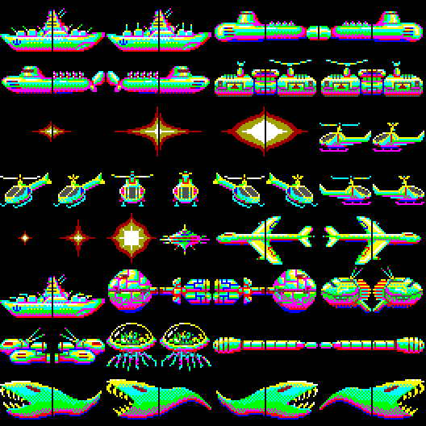 | `DEPTH.C32` |
| 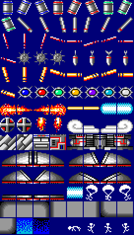 | `DEPTH.C16` |
| 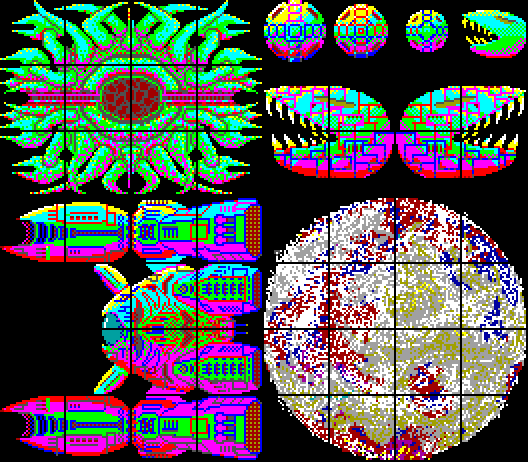 | `DEPTH.BOS` |
| 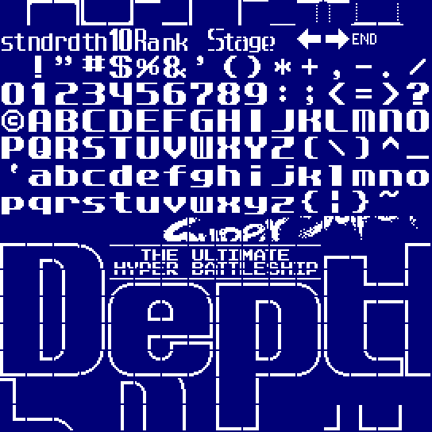 | `DEPTH.FNT`（HUD の文字。PC-98 の外字として使われる） |

## 今の画面

`tests/frames.exe` が書き出したそのままのものです。

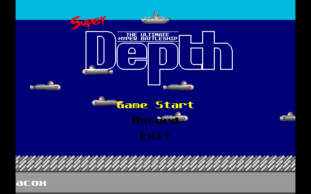
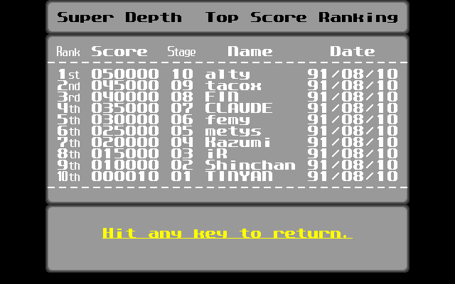
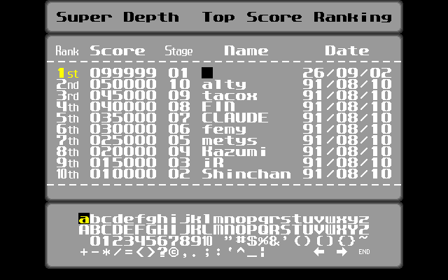

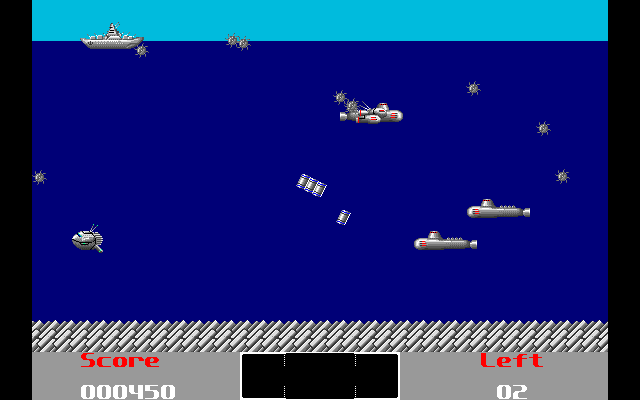
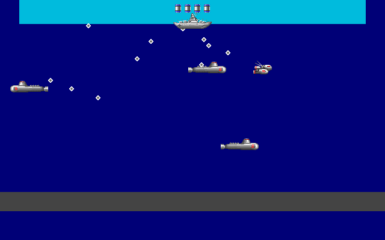
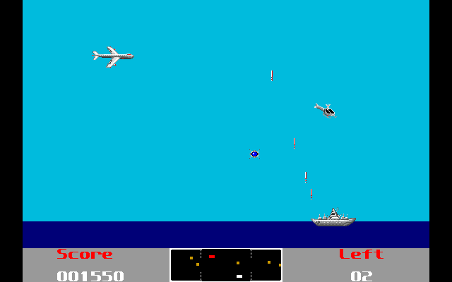
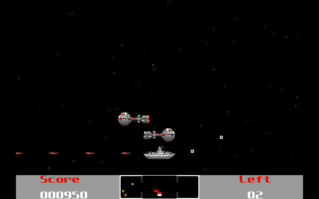
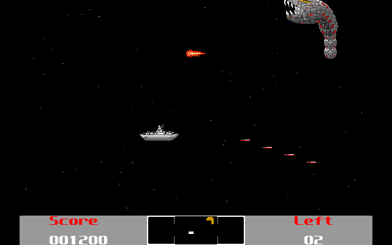
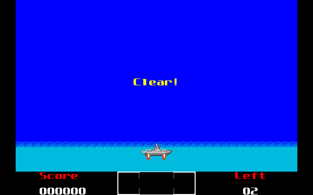

## わかっていること

### DEPTH.EXE

圧縮されていません。中に **Microsoft C 6.0** のランタイム文字列
(`MS Run-Time Library - Copyright (c) 1990, Microsoft Corp`、`R6000` 系の
エラーメッセージ) が入っています。

* コードセグメント 1 本（約 64KB、Ghidra 上では全部 `1000:`）+ DGROUP
* 再配置 7 個。エントリは `0000:e64a` で、そこは MSC のスタートアップ
* 外部ライブラリを 2 つ静的リンク
  * `Superimpose Library Version 0.10` — STUDIO FEMY、スプライト描画
  * `BGM Library ver1.06 use TIMER interrupt` — STUDIO FEMY、音楽
* Ghidra（`x86:LE:16:Real Mode`）で **239 関数、失敗 0**

データファイルは小文字の名前 (`depth.c32` など) で開いています。

### BFNT（グラフィック）

```
0x00  char   magic[4]   "BFNT"
0x04  uint8  0x1a       TYPE したときにここで止まるための EOF
0x05  uint8  flags      0x03 = 16 色, 0x00 = モノクロ
0x08  uint16 width      8 / 16 / 32
0x0a  uint16 height     8 / 16 / 32
0x0e  uint16 last       最終キャラクタコード
0x20             画素データ
```

**画素は packed 4bpp（1 バイト 2 画素、上位ニブルが左）**で、PC-98 の
プレーナ VRAM 配置ではありません。サイズはどちらの解釈でも一致するので、
planar で読むと色付きの砂嵐になるだけで気づけません（一度やりました）。
モノクロのフォントだけ 1bpp・MSB が左です。

サイズ検算（全ファイルで一致）:
`(バイト数 - 32) == (last + 1) * height * (16 色なら width/2, モノクロなら width/8)`

### 音

`DEPTH.BGM` は BGMLIB 用の MML テキストで 15 曲入っています。

```
1. Bio_100%              2. THEME OF SUPER DEPTH   3. SEA
4. SKY                   5. SPACE                  6. BOSS
7. GAME OVER             8. NAME INN               9. SEA CLEAR
10. SKY CLEAR           11. BOSS CLEAR1           12. BOSS CLEAR2
13. BOSS CLEAR3         14. ENDING                15. BOSS ALARM
```

1 曲は `,` 区切りの 3 パートで、曲間は `*`。PC-98 内蔵ビープ（8253 タイマ）
1 音を高速に切り替えて 3 声に聞かせる方式です。`DEPTH.EFS` は効果音で、
周波数の並びが数字で書いてあるだけ。**矩形波 1 音なので正確に再現できます。**

### ゲームの内容（EXE 内の文字列から）

敵の名前:
`Tiddler` `Asthmatic` `Coypu` `Wigwam` `Eyewash` `Spooky` `Fratricide`
`Scourge` `Mean` `Chirstie` `Poppy` `Rob` `Hoot` `Strayed Brain`
`Eerie Core` `Lunatic Noddle` `B.P.S.M.` `Yamaboku`

メッセージ:
`Ready` `Clear!` `Emergency!` `Destroyed!` `Speed Up!` `Shot Max Up!`
`Shot Power Up!` `Flush Bomb!` `Shot Special!` `Full Power!` `Ship 1up!`
`Stage` `Game Over` `Congratulation!!` `Yamaboku find another earth.`

WinDepth には無いパワーアップが一通りあります。

## これから

1. ~~アーカイブの展開~~ 済 — `tools/lzh.py`
2. ~~BFNT の解読~~ 済 — `tools/bfnt.py`、`src/bfnt.c`（238 パターン、番号も原典と一致）
3. ~~パレット~~ 済 — `src/pal.h`（`DS:0x02b8` が面中の色）
4. ~~トップレベルの流れ~~ 済 — ステージ 1..12 を 4 種類の関数で巡回
5. ~~type 1 (SEA) の敵・弾・当たり判定・得点~~ 済 — `src/game.c`
6. ~~アイテムとパワーアップ~~ 済 — 抽選表 `DS:0x0524` と `FUN_1000_9d84` の補正まで
7. ~~スコア表示~~ 済 — PC-98 のテキストプレーン + `DEPTH.FNT` の外字（`src/text.c`）
8. ~~クリア／死亡の遷移~~ 済 — 出口は `FUN_1000_13e0` の先頭にあった
9. ~~フレーム間隔~~ 済 — `DS:0x0dd0` は VSYNC のカウンタ。VSYNC/5 ＝ 毎秒 11 コマ
10. ~~BGM と効果音~~ 済 — `src/sound.c`（8253 の割り込みごと再現）
11. ~~種別 2 (SKY) と 3 (SPACE)~~ 済
12. ~~種別 4（ボス面）~~ 済 — ボス 3 体
13. ~~タイトル画面~~ 済 — `src/title.c`
14. ~~Record（ランキング）~~ 済 — `src/record.c`
15. ~~面と面のあいだの演出~~ 済 — `src/cut.c`
16. ~~ネーム入力（ランキングへの書き込み）~~ 済 — `src/name.c`

**具体的な次の手順・判明しているアドレス・踏んだ罠は
[RESUME.md](RESUME.md) の冒頭「引き継ぎ」にまとめてあります。**

`decomp/`（Ghidra の出力 19,958 行 + 関数 238 個）もコミットしてあるので、
Ghidra が無い環境でも解析を続けられます。

## 権利について

Super Depth はもともと **Bio_100%** が配布していたフリーソフトです。
`orig/` にオリジナルの配布アーカイブ `DEPTH100.LZH` とその中身をそのまま
入れてあります。著作権は Bio_100%（alty & tacox）にあります。
このリポジトリのツールと、これから書く C ソースは解析して書き直したものです。
